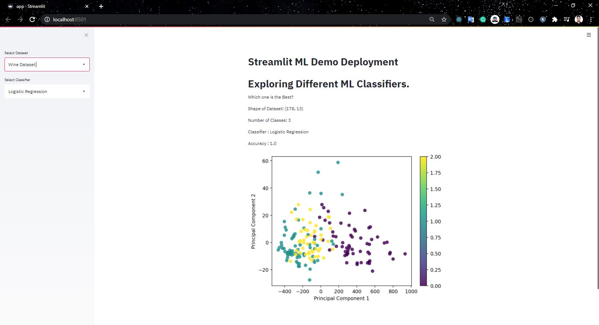
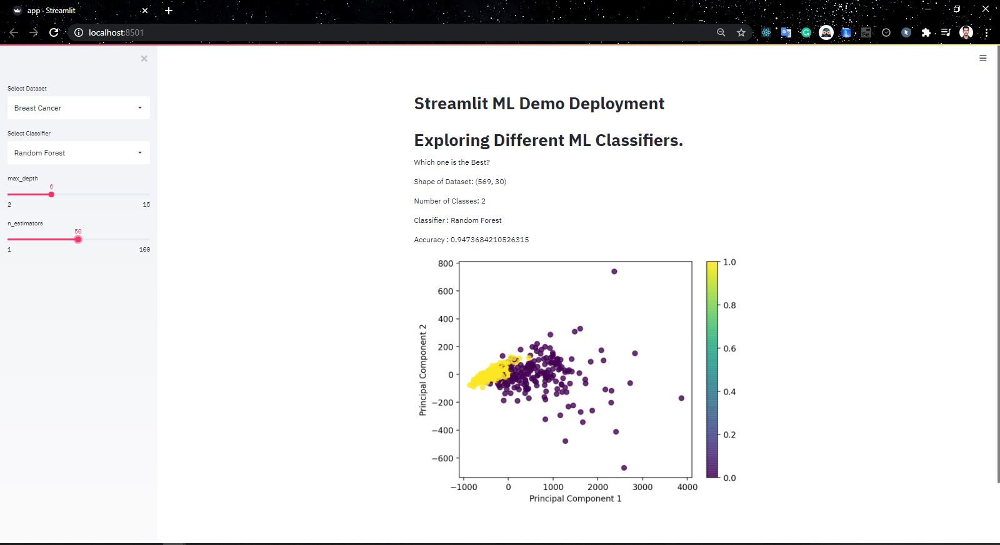

# Streamlit
Demonstration Repository for Streamlit and its Deployment in Cloud Services. [[Heroku](https://heroku.com)].

View Deployment at [Heroku](streamlit-demo-deployment.herokuapp.com).

## Run
```python
streamlit run app.py
```

## Snapshots

### Simple Logistic Regression on `Wine Dataset`


### Simple Random Forest with Panels for Tuning Hyperparameters on `Breast Cancer Dataset`


## Contact Author

Name : Rahul Bordoloi <br>
Website : https://rahulbordoloi.me <br>
Email : rahulbordoloi24@gmail.com <br>

[](https://www.python.org/)
[](https://gitHub.com/rahulbordoloi/)